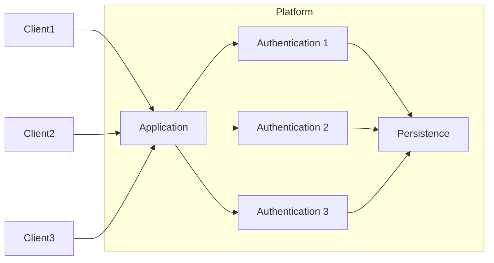
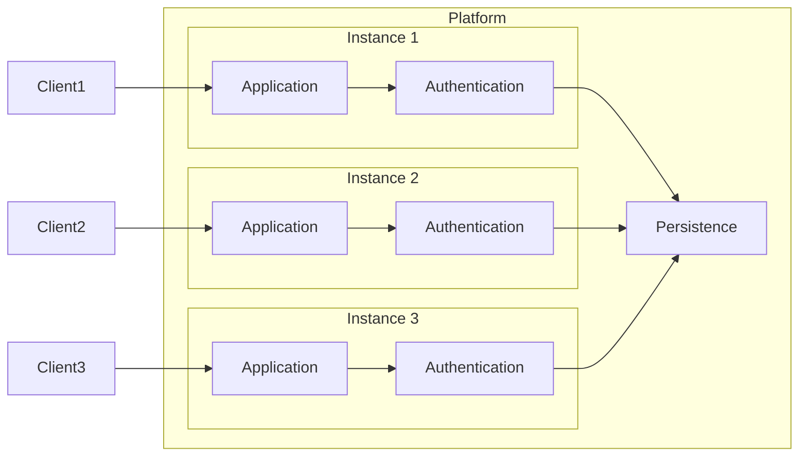

# Architecture

The main architecture is based upon how [CAP](https://cap.cloud.sap/docs/) functions. By providing native support for the CAP paradigms.

## Services

A core piece of most cloud applications is how the services are defined. Which started with the monolithic(macro) service and was generally replaced by micro services. This example introduces a paradigm nano services. Which tries to tackle some common issues in micro services. While also trying to regain some benefits from monolithic programming approaches.

### Monolithic

The general concept of a monolith is one application that contains all functionalities of the application.

Pros:
- One repository
- One version
- Easy to test

Cons:
- Difficult to scale out
- Single point of failure

### Micro

The general concept of a micro service is a smallest unit as a service. Which depend on other services to achieve its full functionality.

Pros:
- Easy to scale out with minimal cost
- Multiple services reduce up time impact
- Multi lingual product

Cons:
- Unknown single point of failure
- Many repositories and combinations of versions
- Difficult or impossible to test the true state

### Nano

The general concept of nano services is functional unit as a service. Which are definitional linked to depending services.

Pros:
- Can scale up and out
- Reduce/remove IO overhead
- Minimize number of repositories
- Easy to test

Cons:
- Requires service definitions
- Requires static dependency trees
- ... More to come

#### Examples

##### Core services

With many micro service applications there is a heavy reliance on some core services. Which makes the premise of no single point of failure invalid. This problem also becomes more prominent when combined with the other feature of scaling out. Which can mitigate the issue up to a point before becoming its own down fall. As not all types of services in the micro service architecture follow its design requirements.

The best example of a bottle neck core service will be authentication. For any app to work it is required to integrate with the authentication service. Which means that any interaction any application will result in a call to the authentication service.

Practical example from `xsuaa` on `BTP`. On BTP every application has an `app router` which is the public facing endpoint to access all services required for using the application. The `app router` is also the barrier enforcing the authentication requirements, but the `app router` does not have the authority to authenticate the client. This is delegated to `xsuaa` which interfaces with `identity` services. Which means that the `app router` will redirect the client to the `xsuaa` end point which will redirect to the appropriate `identity` service. After a successful handshake with the `identity` service `xsuaa` will issue a new session token in both `OAuth` and a `cookie` format. It will store the `OAuth` token into its centralized persistance and hand the `cookie` to the client with a redirect back to the original `app router`. This allows the client to pass the `app router` session check and will let the `app router` contact `xsuaa` to request to the `OAuth` token related to the session `cookie`. Which the `app router` will then pass along to the actual service implementing.

With this approach it is fundamentally required to contact `xsuaa` for every request send to any application on `BTP`. As this problem becomes very big very quickly it had forced the `app router` to implement session caches. Which allows the `app router` to only contact `xsuaa` once for each session. Except for the fact that the `app router` is a micro service. Therefor it has multiple instances. Which all have their own isolated cache. Which means that at most there will be as much calls to `xsuaa` as there are `app router` instances for each session. It turned out to still produce to many calls to `xsuaa`. Therefor the `app router` has the ability to use a shared `redis` cache. Which is a small monolith inside the architecture. The root cause for the number of request being to much for `xsuaa` was also related to a monolith. The persistence of the `xsuaa` service was a monolith. Which meant a limited number of parallel connections and therefor also a hard limit on how many instances of `xsuaa` could be created.



So how would a nano service approach try to solve the issue of core services.

By defining the service dependencies it is possible to identify the functionalities the service requires. If there is an application that requires authentication it is possible to include the authentication service inside the application. Which will transform the call to the authentication service into an internal function call. This saves the network overhead that comes with calling central services. As the major load of the authentication service is linking a session `cookie` to an `OAuth` token it is possible to define caching into the authentication service and this caching will automatically apply inside the consuming application service. Additionally it is possible to remove cache misses by always connecting the session client to the `cookie` owner. Even if in some cases it is required to call another service with the session `cookie` it is possible for that service to call to the original `cookie` creator to retrieve the `OAuth` token. When extrapolating the implications of having a `cookie` owner it is now possible to only have the application cache for the `OAuth` token. Which means that only when creating a new session it is required to query the persistence layer. An inherit side effect of this approach is that it is not required to scale out the authentication service. As it will always be embedded in all the application instances. So while never deploying the authentication service explicitly it is the most deployed service on the platform as every application has to depend upon it.



##### Project Definition

To improve the development experience a monolithic approach of development is taken. By following the general CAP way of defining services it is possible to take the monolithic application and scale it up and out. This is also the fundamental way that this project is designed. By having each service defined in the default `srv` folder with dependencies defined in between the services. Which allows the deployment to determine whether to split services into separate processes / hosts or to combine services into the same process.

For example while doing development it is normal to only have a single host there for it would look something like:

```bash
srv -- instance 1
├── authentication
├── authorization
├── deploy
├── dns
└── ...
```

While the same project setup deployed to 2 hosts would look something like:

```bash
srv -- instance 1
├── authentication
├── authorization
├── deploy
└── dns

srv -- instance 2
├── authentication
├── authorization
└── ...
```

It is still possible to split up two dependent service over multiple hosts. As the API to call a service can check whether the service is available in the current process or not. If not it can call the service on the platform and have it redirect to the other host. Splitting the services over different hosts would be determined by the weight of a service. When the combined weight of all services is larger then the available capacity on a single host the services will be distributed over multiple hosts.
