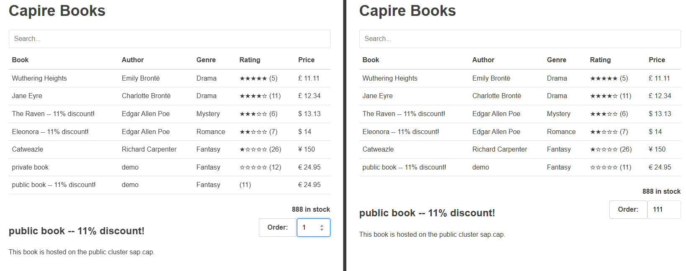
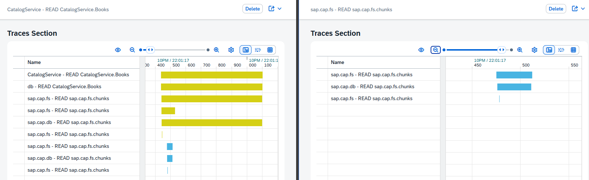

# Example

Here is a collection of examples demonstrating the capabilities of CAP.

## Database

The backbone of CAP is `db`. It provides the capabilities required to deploy `cds` models and execute `cqn` queries. One of the unusual behaviors that `db` has is that it is capable of querying large distributed datasets. This is achieved purely through data structure design. By having specific information stored into the table files it is possible to address any number of chunks of data even distributed over different clusters. Additionally the storage format is designed to be capable of doing time traveling for potential auditability requirements.

In the following image it shows how the private cluster is able to access the public data entries. While the public cluster is unable to see the private data entries.

When handling large workloads it becomes required to be capable of identifying root causes of problems. A common method of doing this is by collecting telemetry data also called traces. The practice of collecting traces comes with the problem of producing massive datasets. Additionally it is required that the collected traces are complete. Meaning that many different pieces in the landscape have to collect traces in an uniform method. All of these problems are automatically solved by `db` as each cluster is capable of collecting large datasets without much overhead as all data is stored nearby. Additionally a possible problem for CAP would be that traces would be incomplete as some requests will cross cluster boundaries, but this potential problem is also inherently solved by `db` as it treats the traces table as a single table.

In the following image it shows the same trace of a request that was processed by both the private and public cluster. While the public cluster can't see what the private cluster is doing it does have access to all the information it possibly would need to solve any potential problems caused by the request of the private cluster.

